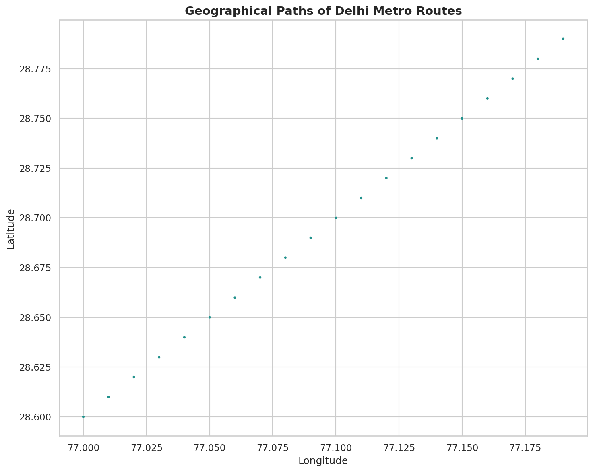
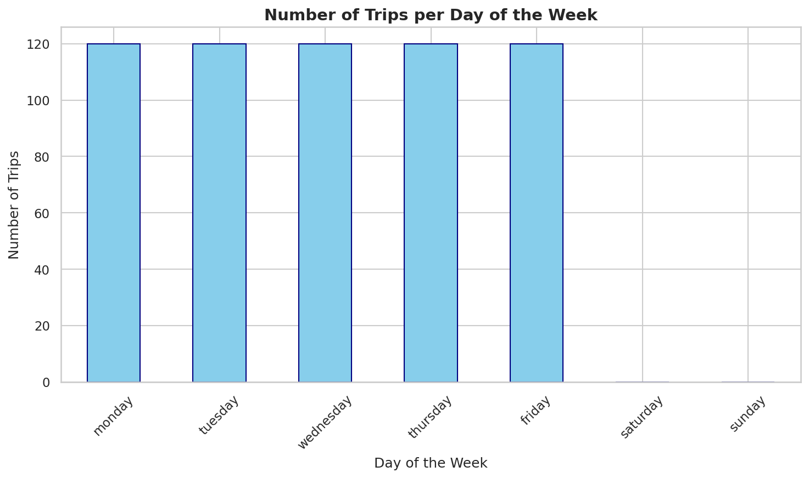
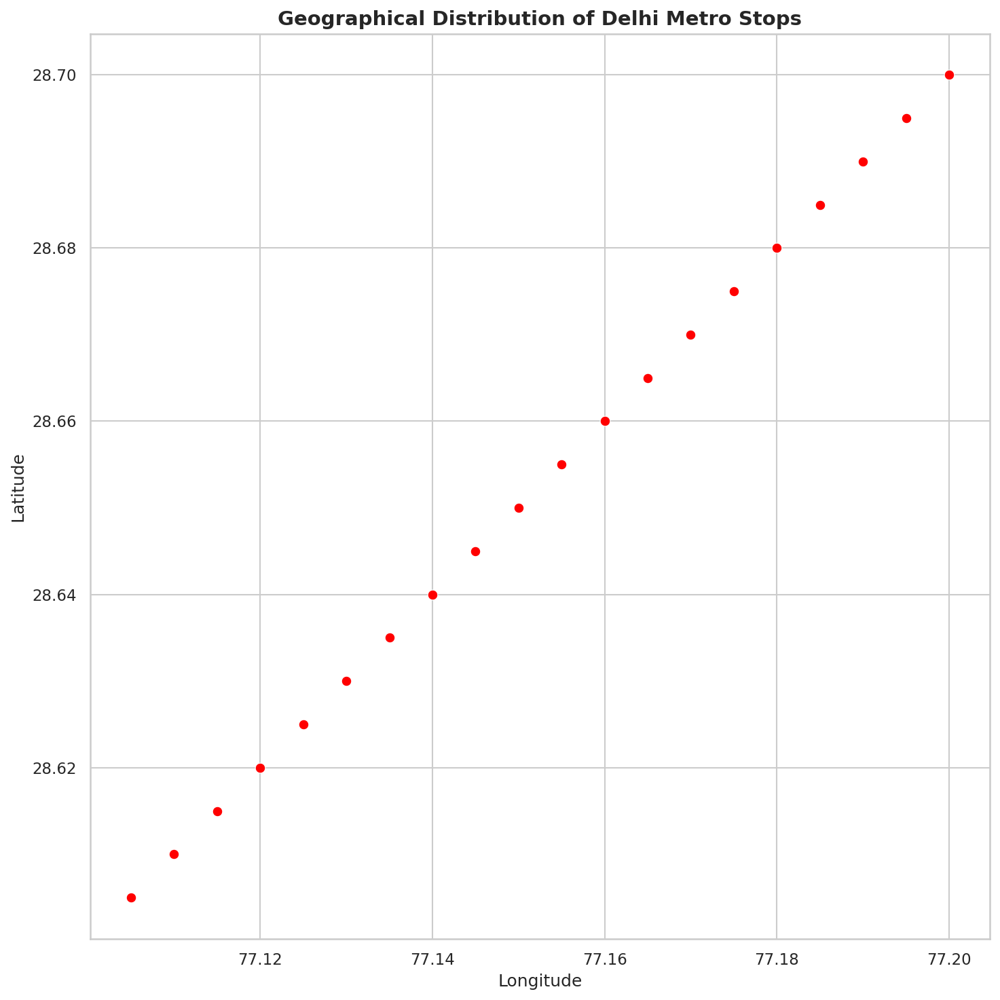
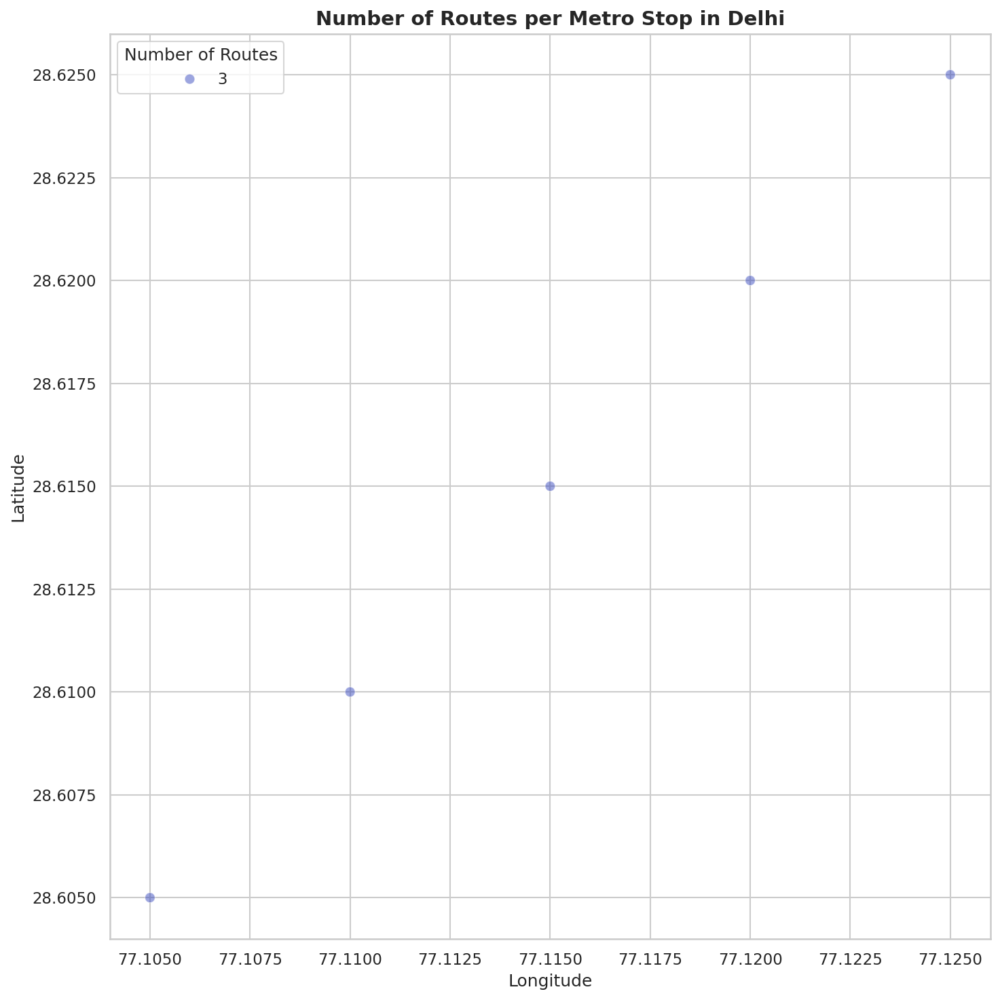
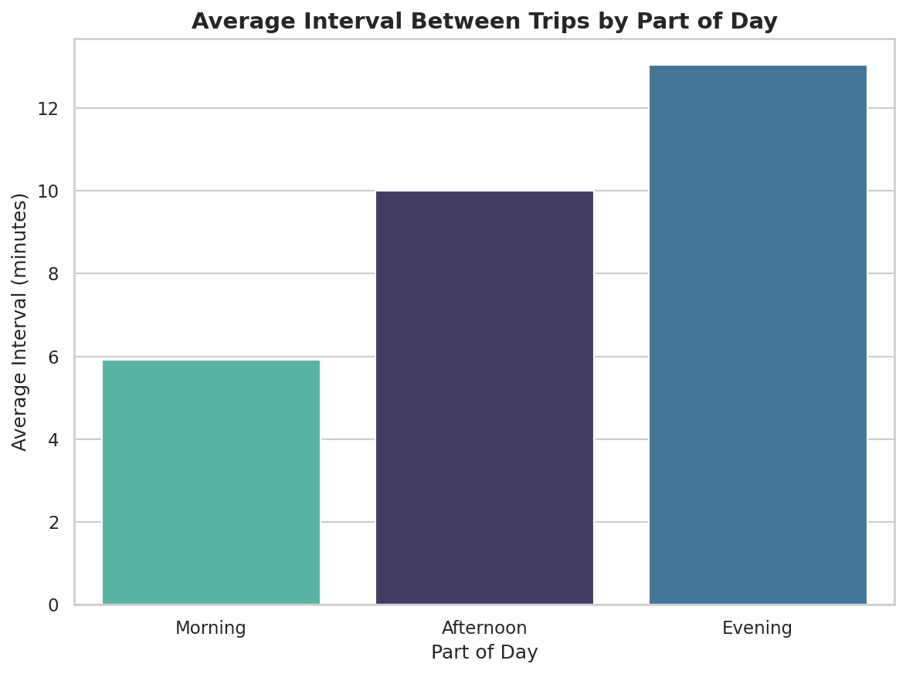
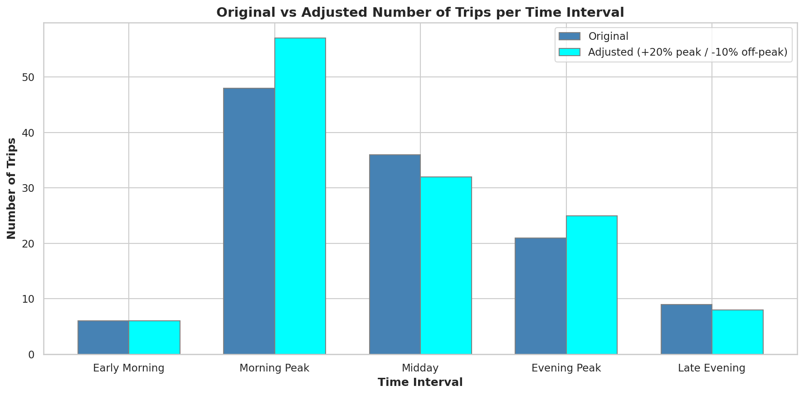

# 🚇 Delhi Metro Operations Optimization

> A data-driven analysis of Delhi Metro schedules using real GTFS transit data to reduce overcrowding and improve operational efficiency.

---

## 📌 Objective

Delhi Metro serves millions of passengers daily but faces two core problems:
- **Overcrowding** during peak hours (morning & evening rush)
- **Wasted resources** during off-peak hours (midday & late night)

This project analyzes real GTFS data to identify demand patterns and propose an optimized schedule.

---

## 📊 Key Results

| Time Slot | Adjustment | Reason |
|---|---|---|
| Morning Peak (6–10 AM) | **+20% trips** | High demand — reduce wait time |
| Evening Peak (4–8 PM) | **+20% trips** | High demand — reduce wait time |
| Midday (10 AM–4 PM) | **−10% trips** | Low demand — cut operational cost |
| Late Evening (8 PM+) | **−10% trips** | Low demand — cut operational cost |

---

## 🗺️ Visualizations

### 1. Geographical Paths of Delhi Metro Routes


### 2. Trips per Day of the Week


### 3. Geographical Distribution of Stops


### 4. Stop Connectivity (Bubble Map)


### 5. Average Interval Between Trips by Part of Day


### 6. Original vs Adjusted Schedule


---

## 📂 Dataset

**GTFS (General Transit Feed Specification)** data from Delhi Metro Rail Corporation (DMRC).

| File | Description |
|---|---|
| `agency.txt` | Operator info (DMRC) |
| `calendar.txt` | Service days (weekday/weekend) |
| `routes.txt` | Metro line details |
| `shapes.txt` | GPS path coordinates |
| `stops.txt` | Station names and locations |
| `stop_times.txt` | Arrival/departure times per stop |
| `trips.txt` | Trip-to-route mapping |

Place all `.txt` files in the `data/` folder before running.

---

## ▶️ How to Run

```bash
# 1. Clone the repository
git clone https://github.com/Tanishq-Soni77/metro-optimization.git
cd metro-optimization

# 2. Install dependencies
pip install -r requirements.txt

# 3. Add GTFS data files to data/ folder

# 4. Run the script
python metro_optimization.py
```

---

## 🛠️ Tech Stack

| Library | Purpose |
|---|---|
| `pandas` | Data loading, merging, and manipulation |
| `matplotlib` | Core plotting |
| `seaborn` | Statistical visualizations |
| `datetime` | Time parsing and interval calculation |

---

## 💡 Approach

1. **Visualize** Delhi Metro routes and stop locations on a map
2. **Analyze** trip frequency patterns across days and time slots
3. **Calculate** average intervals between trains by time of day
4. **Identify** peak vs off-peak demand windows from the data
5. **Propose** adjusted schedules with +20% peak / −10% off-peak frequency

---

## 📁 Project Structure

```
metro-optimization/
│
├── data/                    ← GTFS .txt files (add before running)
├── metro_optimization.py    ← Main analysis script
├── requirements.txt         ← Python dependencies
└── README.md                ← Project documentation
```

---

## 👤 Author

**Tanishq Soni**  
IIT Kanpur  
[GitHub](https://github.com/Tanishq-Soni77)
